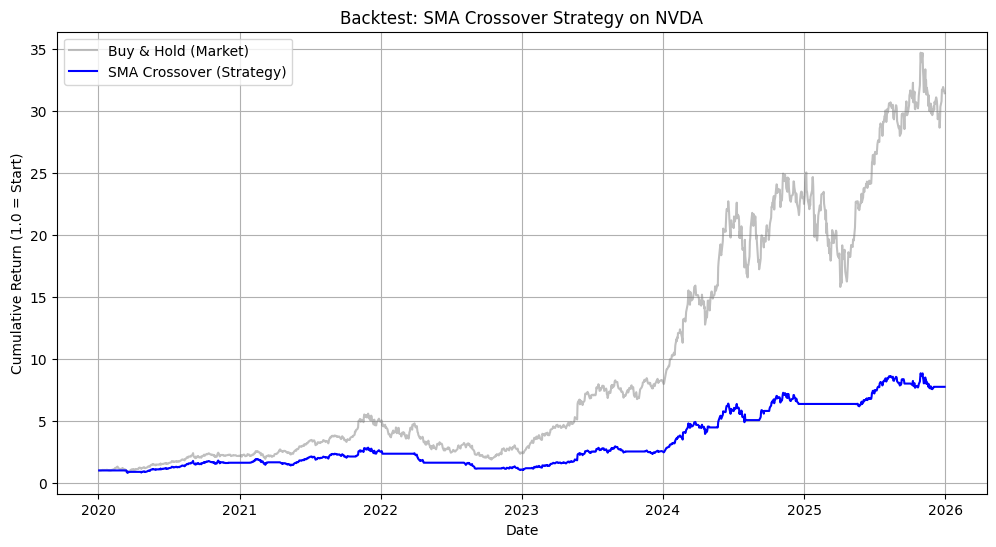
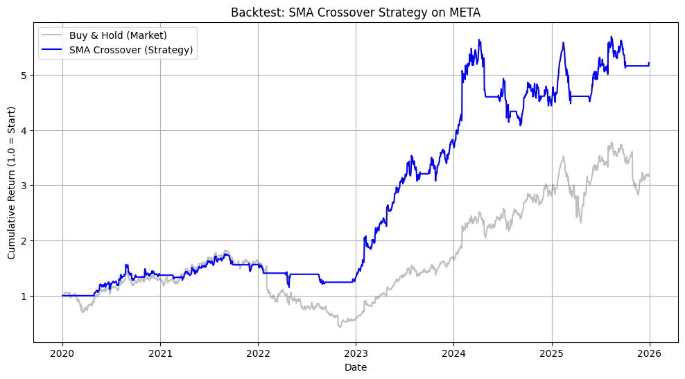
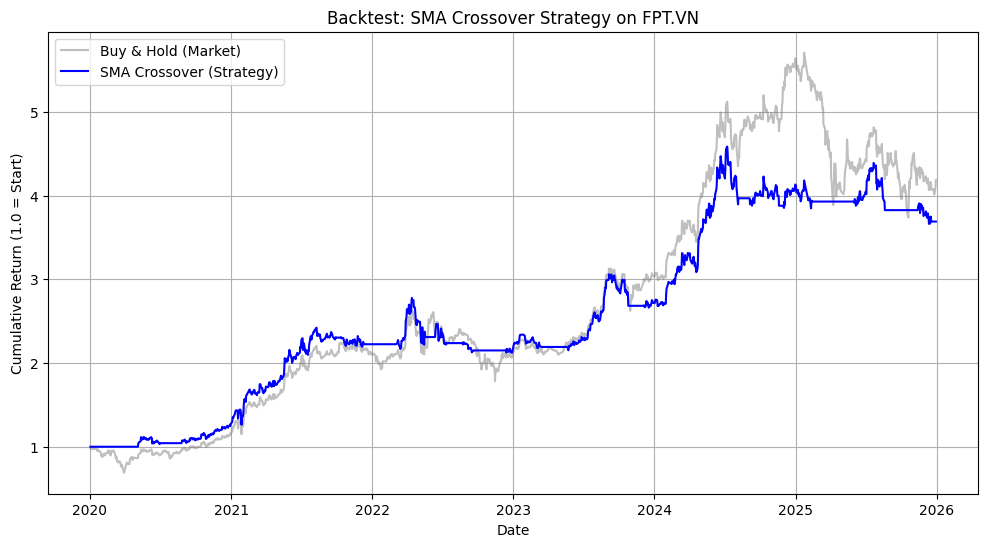

# Analysis of the strategy

This document explains the results for Nvida (NVDA), Meta (META) and FPT (FPT.VN)

## NVDA (High growth, high volatility)
- Market return: 31.41×
- Strategy return: 7.74×
- Max drawdown: −63.6%
- Sharpe: 1.07

NVDA experienced strong, fast regime shifts; hence, the strategy entered (buy/sell) late. This is usaluuy called "signal lag".

## META (Moderate growth, regime change)
- Market return: 3.20×
- Strategy return: 5.22×
- Max drawdown: −34.48%
- Sharpe: 1.08

META had distinct regimes (growed steadily but decreased significantly in 2023, followed by sharp growth in 2024 and 2025). Hence, the strategy outperform (the benchmark) when trend persistence outweighs noise.

## FPT.VN (Gradual growth, lower volatility)
- Market return: 4.19×
- Strategy return: 3.69×
- Max drawdown: −23.57%
- Sharpe: 1.15 (highest of the three)

Although total return is slightly lower, risk-adjusted performance is strong, indicating better stability.

## Conclusion
The SMA(20,50) momentum strategy performs best in assets with persistent, moderately volatile trends, where signal lag is outweighed by trend duration.

In assets with rapid price acceleration or high volatility, the strategy underperforms buy-and-hold due to delayed entries, delayed exits, and increased drawdowns caused by regime shifts.